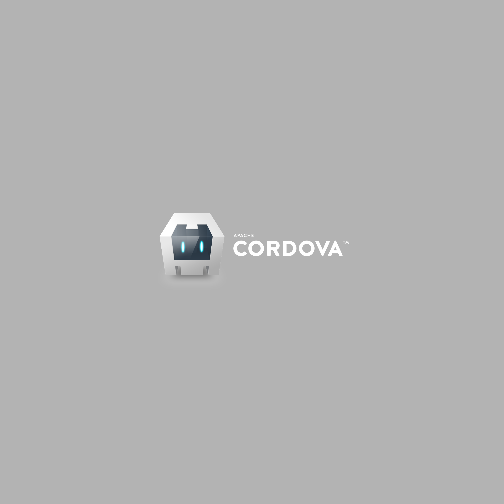

# Fine-tuned Launch Storyboard Example

Based on [the PhoneGap Hello World template](https://github.com/phonegap/phonegap-template-hello-world); only `config.xml` and launch images have been changed.

In this example the launch image mirrors the typical Cordova launch image, and the image is fine-tuned to work on a variety of devices. As such, six launch images are included.

The primary launch image is below:

All the other launch images are derivations of this image. [See other images](./res/screen/ios/)

[View iOS simulation](https://cdn.rawgit.com/kerrishotts/launch-storyboard-images-previewer/0.3-release/index.html?at2x-universal-comany=examples/cordova-robot/Default@2x%7Euniversal%7Ecomany.png&at2x-universal-comcom=examples/cordova-robot/Default@2x%7Euniversal%7Ecomcom.png&at3x-universal-anyany=examples/cordova-robot/Default@3x%7Euniversal%7Eanyany.png&at3x-universal-comany=examples/cordova-robot/Default@3x%7Euniversal%7Ecomany.png&at3x-universal-anycom=examples/cordova-robot/Default@3x%7Euniversal%7Eanycom.png&at2x-universal-anyany=examples/cordova-robot/Default@2x%7Euniversal%7Eanyany.png)

## Credits

* Cordova Robot: Copyright © 2012, 2013, 2015 The Apache Software Foundation, Licensed under the Apache License, Version 2.0.

## License

Apache 2.0 License

